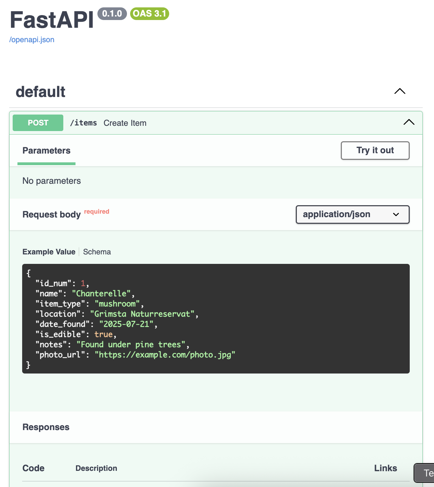

# Step-by-step instructions

## Setup

See the [README](./README.md#setup) file for the required setup.

## Testing out `fastapi` and `uvicorn`

1. Set up your FastAPI by creating your `main.py` file.

    **Tip**: You can start with something simple, such as:

    ```python
    # main.py
    from fastapi import FastAPI

    app = FastAPI()

    @app.get("/")

    def read_root():
        return {"message": "This is YOUR API!"}
    ```

1. From the terminal, in the same folder where `main.py` is located, run the following command:

    ```bash
    uvicorn main:app --reload
    ````

    If the script was successful, you can try opening your browser to:

    * http://localhost:8000 - shows the welcome message.

    * http://localhost:8000/docs - shows your API in Swagger UI

    * http://localhost:8000/redoc - shows your API in Redoc UI

    **Troubleshooting**: To ensure that the the `uvicorn` command runs successfully, make sure you are using a [virtual environment](https://code.visualstudio.com/docs/python/tutorial-fastapi) (venv).


## Add a Pydantic model for `ForageItem`

1. In your `main.py` file, add to the top, below the FastAPI import:

    ```python
    from pydantic import BaseModel, Field, HttpUrl
    from typing import Optional
    from datetime import date
    ```
1. Define the `ForageItem` model, by creating a new class:

    ```python
    class ForageItem(BaseModel):
        id_num: int = Field(..., example=1, description="Unique ID for the item")
        name: str = Field(..., example="Chanterelle", description="Name of the mushroom or berry")
        item_type: str = Field(..., example="mushroom", description="Either 'mushroom' or 'berry'")
        location: str = Field(..., example="Grimsta Naturreservat", description="Where it was found")
        date_found: date = Field(..., example="2025-07-21", description="Date of the foraging event")
        is_edible: bool = Field(..., example=True, description="Whether the item is safe to eat")
        notes: Optional[str] = Field(None, example="Found under pine trees", description="Extra notes")
        photo_url: Optional[HttpUrl] = Field(None, example="https://example.com/photo.jpg" description="Optional image link")
    ```

    *Explanation of the Python constructs used:*

    * `BaseModel` a **class** that is the "core" of Pydandic. All your data models inherit from it.

    * `Field()` a **function** that lets your customise descriptions, examples, and validation.

    * `HttpUrl` a **type** that ensures only valid URLs are provided for image links.

    * `Optional[...]` a **type** that lets you declare if a field is optional.

    * `date` a **class** allows you to store calendar dates, as a `date` data type, not just as a string (`str`). FastAPI will automatically convert string input into a `date` type if the format is valid.

1. Run the API with the following command:

    ```bash
    uvicorn main:app --reload
    ````

1. Visit the [Swagger](http://localhost:8000/docs "http://localhost:8000/docs") or [Redoc](http://localhost:8000/redoc "http://localhost:8000/redoc") version of the API to see how it has been rendered.

## Create basic `/items` endpoint to **POST** new items

1. Create an empty list to act as a "fake" database, after `app=FastAPI()`:

    ```python
    fake_db = []
    ```

    This list will hold each `ForageItem` that you `POST`. It acts as a temporary storage. You can later replace this with a real database, such as SQLite.

1. Define `POST /items` route:

    a. Add the following to your imports:

    ```python
    from fastapi import HTTPException
    ```

    b. Update the `@app.get` to `@app.post`.

    c. In `@app.post`, add the following:

    ```python
    @app.post("/items", response_model=ForageItem, status_code=201)
    ...
    ```

    *Explantion of elements used:*

    * This creates a `POST` endpoint at `/items`

    * `response_model=ForageItems` tells FastAPI to use the same schema when sending the response

    * `status_code=201` is the HTTP code for "Created"

1. Use the `ForageItem` model to validate incoming data, by adding the following in the next line after `@app.post()`:

    ```python
        def create_item(item: ForageItem):
        if any(existing.id == item.id for existing in fake_db):
            raise HTTPException(status_code=400, detail="Item with this ID already exists.")


    ```

1. Add the new item to the list and return it:

    ```python

            fake_db.append(item)

            return item
    ```

1. Go to http://localhost:8000/docs, click **POST /items**, and try the following sample payload:

    ```json
    {
        "id": 1,
        "name": "Chanterelle",
        "type": "mushroom",
        "location": "Tyresta National Park",
        "date": "2025-07-21",
        "is_edible": true,
        "notes": "Found under pine trees",
        "photo_url": "https://example.com/chanterelle.jpg"
    }
    ```
    

    You should get a ``201 Created`` response and see your item echoed back.


Full code added from this section:

```python
# main.py

from fastapi import FastAPI
from fastapi import HTTPException
from pydantic import BaseModel, Field, HttpUrl
from typing import Optional
from datetime import date


# Create an instance of the FastAPI application
app = FastAPI()

# Temporary in-memory storage for forage items
fake_db = []


# Define a new data model called ForageItem, which inherits from BaseModel, so FastAPI knows how to parse, validate, and document it
class ForageItem(BaseModel):
    id_num: int = Field(..., example=1, description="Unique ID for the item")
    name: str = Field(..., example="Chanterelle", description="Name of the mushroom or berry")
    item_type: str = Field(..., example="mushroom", description="Either 'mushroom' or 'berry'")
    location: str = Field(..., example="Grimsta Naturreservat", description="Where it was found")
    date_found: date = Field(..., example="2025-07-21", description="Date of the foraging event")
    is_edible: bool = Field(..., example=True, description="Whether the item is safe to eat")
    notes: Optional[str] = Field(None, example="Found under pine trees", description="Extra notes")
    photo_url: Optional[HttpUrl] = Field(None, example="https://example.com/photo.jpg", description="Optional image link")


# Define a route: when someone visits GET / (the root), this function runs
@app.post("/items", response_model=ForageItem, status_code=201)
def create_item(item: ForageItem):
    # Check for duplicates by ID
    if any(existing.id == item.id for existing in fake_db):
        raise HTTPException(status_code=400, detail="Item with this ID already exists.")

    # Add the item to the fake database
    fake_db.append(item)

    return item

```

## Add `GET /items` to list all foraged items

Now that the API allows you to create (but not yet store) items, add to the script to be able to retrieve items.

1. Add the following to `main.py`:

    * Import `typing` from `List`
    * Add `@app.get` and the following function below the existing `POST` route

    ```python
    from typing import List
    ... # Rest of the script

    @app.get("/items", response_model=List[ForageItem])
    def get_all_items():
        return fake_db
    ```

    *Explanation of what was added:*

    For `@app.get`,

    * The function defines a **GET endpoint** at `/items`.

    * The `response_model` declares that it will return a list of `ForageItem`s.

### Testing


